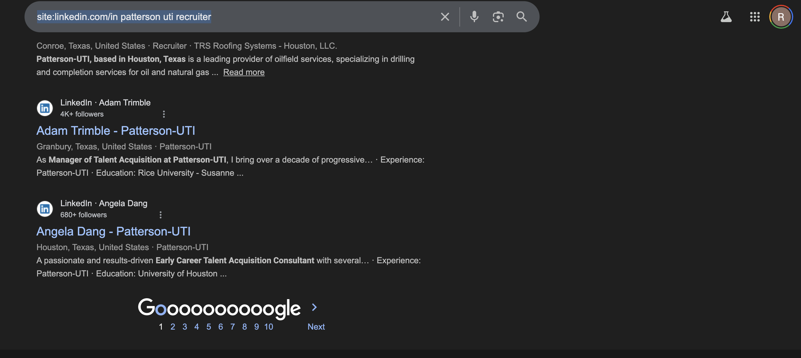
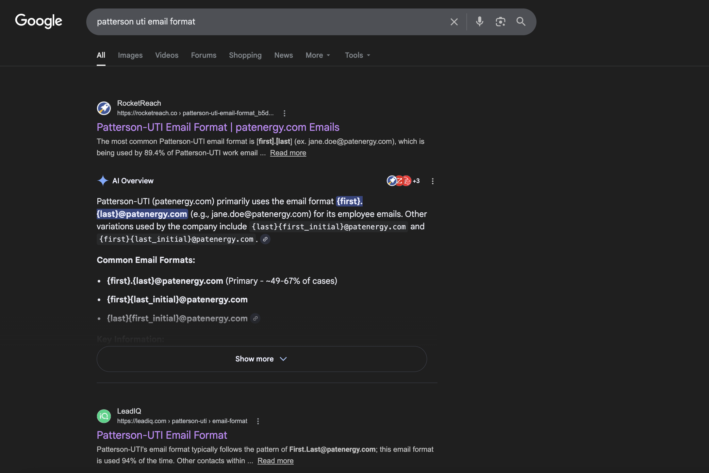
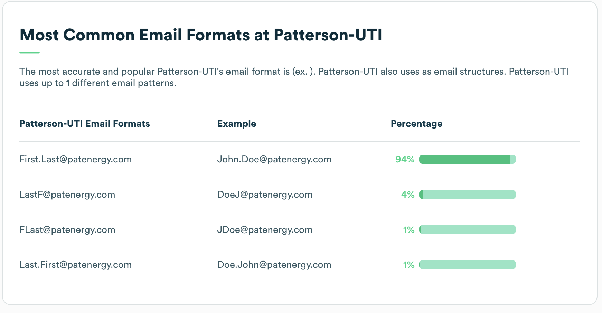

# CougarCS Email Spammer!

## Purpose

We want CougarCS and CodeRED to be as big as possible!

## Companies

1000 companies scraped from YC, 100 scraped from Houston Chronicle's top 100 Houston-based companies, and 500 scraped from Kaggle's 2025's Fortune 500 companies.

The purpose of the company scraping is to keep us organized: By keeping a concrete list of companies, we can easily divide the work and make sure that we aren't sending emails to the same companies.

## High Level Overview

With a big list of companies, we're gonna manually look for contacts for each company. We're gonna pull up the most likely possible email combinations for each company and email about 3-5 folks from each company, using LinkedIn/Google search results. Grab the data, and collect the data into a Google Sheet, which will be pulled into a server.

The server will take care of automating the email sending, which will be about 30-50 emails a day. It'll do some simple verification, queuing, time/timezone checking, and schedule emails to go out within the allowed window.

## Instructions

1. Ask me (Ricky) for list of companies. I'll be sending batches of 100 companies, which vary from Fortune 500 companies to local Houston companies. I'll also be sending a Google Sheets link of the list of all of the companies, which is how we'll keep track of our progress and where we'll pull the information to automate our email sending!
2. Now, the actual company searching:
a. Start from the top of the list. Copy and paste the company name.
b. Go to Google, and create the following search result:<br>`site:linkedin.com/in {companyName} {companyRole}`.<br>For the company roles, we're going to use the following:<br> ```recruiter,
    talent acquisition,
    campus recruiter,
    university recruiter,
    early talent,
    university relations```.<br>You can use one at a time, or all at the same time.<br>(Note: Why not just use LinkedIn? Well, you can! I just found this to be a little more faster.)
c. Now, for the old reliable method. Once you have about 3-5 contacts from that company, look up `{companyName} email format` in Google. You'll get search results for RocketReach.com, ZoomInfo.com, and LeadIQ.com, among other websites that will give you the most likely email format for that company. <br>Now, for the email formats, we want to cover as much ground as possible with emails while sending out the minimum number of emails per potential contact. This means that you want to grab at most 3 email patterns per company, and try to limit it to 1 if possible. A good cumulative percentage to aim for is 70%, so, for example, if the first email pattern has a 65% chance, the second one has 10% chance, and the third has 5%, then grab the first and second email patterns only.
d. (Optional) To cut down on misses, cross-reference the contacts and the email pattern by searching through their LinkedIn profile or through Google searches. If you can find a sure-fire email, then great! We know for sure that the email pattern is in use, and you continue with that one. More importantly, if there is less likely email patterns (with &lt;15%), then you can cut those out in favor of the sure-fire email pattern you just found. This is more about cutting down less likely options to send out less emails in the end.
3. Now that you have some potential contacts and possible email combinations, put the info down on the Google Sheet. The backend will take care of the rest.

## Example

Let's take our favorite company, Patterson-UTI! Looking up `site:linkedin.com/in patterson uti recruiter`provides us with these results:



As you can see, we have a couple of results. Let's take *Angela Dang* as a potential contact.

Now, let's look for the Patterson-UTI email pattern. Looking up `patterson uti email format` provides us with these results:



**Ignore the AI results, they can't be trusted!**

Anyway, we have a couple of leads: LeadIQ and RocketReach. Let's take a look at LeadIQ:



As we can see, the pattern `first.last@patenergy.com` has us at 94%, meaning it's a good threshold for email patterns, and we only need to use that one as a potential email pattern.

Now that we have our potential contact and email pattern, it's time to input it into our Google Sheet!

The Google sheet will look something in the format:

`CompanyName|FirstName|LastName|Email`

In this example: We want our information to look like
`Patterson-UTI|Angela|Dang|angela.dang@patenergy.com`

Make sure to spell it out correctly! Each email will be checked somewhat, but what you type here is what gets sent out in the email!

For each email pattern you acquired, you input a new row. So, if Patterson-UTI had another email pattern in the form:

`FirstIntial.LastName@patenergy.com`

Then you would create another row that looks like:

`Patterson-UTI|Angela|Dang|a.dang@patenergy.com`

And that's it! If you entered everything correctly, all of the information will be queued in our system and eventually sent out!


## Emails

### CougarCS Version

Hi {{first_name}},

I hope this email finds you well! My name is {{officer}}, and I'm the {{emailer_role}} for the University of Houston's largest Computer Science student organization, CougarCS.

CougarCS is an ACM chapter organization committed to the professional development and academic success of our 200+ active members. We provide various services to our students, including company-sponsored career readiness workshops, personalized tutoring sessions, and a wide library of open-source projects built and maintained by our members. We've worked with companies such as Google, Microsoft, and Apple, and have partnered with over 50 companies to bring exciting events for our members. Additionally, we host CodeRED, the largest hackathon at UH.

As a sponsor, {{company}} will have access to several CougarCS perks, such as candid facetime with experienced student developers, extensive brand recognition marketing through our social media platforms, and a live environment where users can test your product and provide direct feedback. {{company}} can expect no less than a multitude of recruitment and marketing opportunities from our team!

I would love to set up a quick chat to discuss a potential partnership between CougarCS and {{company}}. If you would like to learn more about our organization, please refer to our website:
      
cougarcs.com

Thank you for your time! We look forward to hearing from you soon.

Best regards,
{{officer}}, {{emailer_role}}

### CodeRED Version

Dear [Employer],


Hello, it's nice to meet you, [FirstName]! My name is [EmailerName], and I'm the [EmailerRole] for the University of Houston's largest Computer Science student organization, CougarCS.

CougarCS is an ACM chapter organization committed to the professional development and academic success of our 200+ active members. We provide various services to our students, including company-sponsored career readiness workshops, personalized tutoring sessions, and a wide library of open-source projects built and maintained by our members. We've worked with companies such as Google, Microsoft, and Apple and have partnered with over 50 companies to bring exciting events for our members.

This October from the 10th to 11th, CougarCS will host CodeRED Orion, the University of Houston's largest annual CS hackathon. CodeRED has attracted thousands of creative and determined developers to create innovative software and challenge their collaborative and technical skills in a tight 24-hour window. We see CodeRED as an opportunity for students to learn about new technologies and interact with the greater programming community, and we would love to have [Company] as a sponsor for our hackathon!

As a sponsor, [Company] will have access to several CougarCS and CodeRED perks, such as candid facetime with experienced developers, extensive brand recognition marketing through our social media platforms, and a live environment where users can test your product and provide direct feedback. [Company] can expect no less than a multitude of accomodations and recruitment opportunities from our team, and we aim to deliver a smooth experience from the initial sponsor announcement to the moment our doors close on October 11th.

I would love to set up a quick chat to discuss a potential partnership between CougarCS and [Company]. If you would like to learn more about our organization and hackathon, we have provided links with more information.

LINKS:
* cougarcs.com
* orion.uhcode.red
* mlh.io

Thank you for your time! We look forward to hearing from you soon.

Best regards,

[EmailerName]

## Final Notes

The backend is still WIP, and I'm aiming to have it out by late next week.


